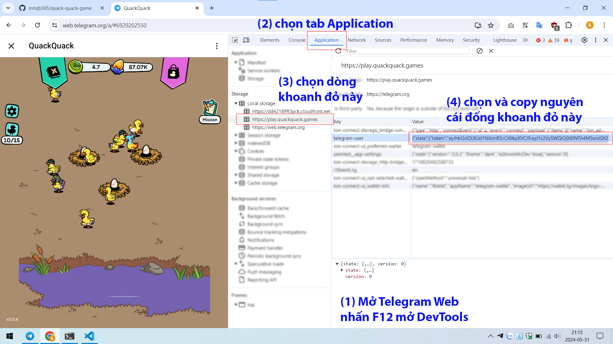
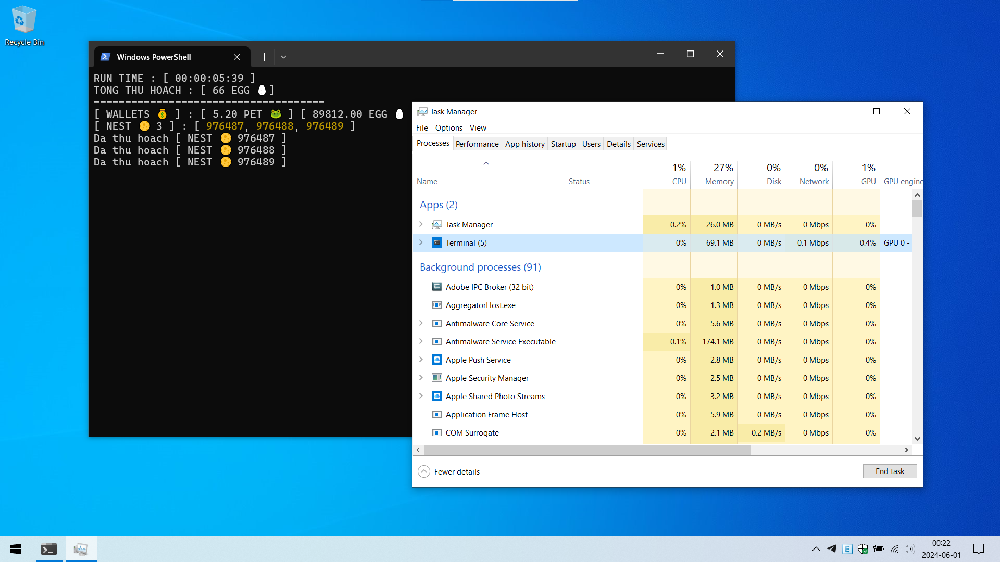
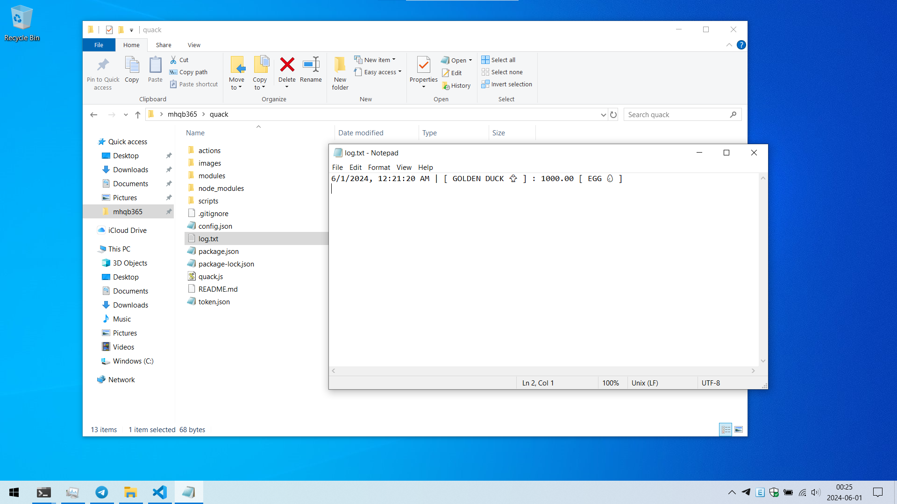

# Tool Quack Quack Game

> Windows / Mac / Linux đều dùng được miễn có cài NodeJS. Link tải đây https://nodejs.org/en/download/prebuilt-installer

## Tuyên bố miễn trừ trách nhiệm

> Tui (mhqb365) là chủ sở hữu của những đoạn code trên và tui (QTieee) là người cải thiện UI và sửa lỗi những đoạn code trên chúng tui tuyên bố sẽ miễn trừ trách nhiệm khi bạn sử dụng những đoạn code này

> Bạn có quyền sử dụng nó tùy ý, tuy nhiên xin lưu ý rằng trong mọi trường hợp, khi bạn sử dụng những đoạn code trên cho những mục đích xấu, sửa đổi hoặc những việc tương tự nhằm mục đích gây hại cho những cá nhân, tổ chức khác, bạn sẽ phải chịu trách nhiệm cho những việc đó. Tôi sẽ không phải chịu bất cứ trách nhiệm gì từ việc này

> Chúc bạn sử dụng bot vui vẻ!

### Tính năng

> Lụm Zịt Zàng (cái con bạch tuột mỏ vịt xuất hiện mỗi 30 phút)

> Không claim được TON từ Zịt Zàng (muốn claim phải có key ví, ai lại đi bỏ key ví vào Tool bao giờ)

> Lụm toàn bộ trứng

> Bản cập nhật này chỉ để thêm các thư viện  (axios, easytimer, random-useragent) để Tool hoạt động ổn định hơn

> Chưa có ấp trứng kiếm vịt xịn, nhưng trong tương lai gần sẽ có

> Đã update code của mhqb365 để sửa lỗi lụm Zịt Zàng.

> Chỉnh sửa lại UI code có sẵn cho thuận tiện trong việc theo dõi.

#### Cách dùng

> Cài NodeJS chưa? Chưa thì kéo lên trên lấy link tải về cài vào

> Tải Tool về, thấy cái nút (<> Code) màu xanh lá ở trên hem? Bấm vào đó để Download ZIP

> Giải nén và truy cập vào folder của Tool

> Máy tính cần hiện đuôi file để thao tác dễ hơn. Thao tác bằng cách từ start menu, folder options -> bỏ tick phần bôi đỏ


> Ví dụ file ```config.json``` mà máy không hiện đuôi file thì chỉ nhìn thấy cái file có tên ```config``` thôi

> Copy Token game paste vào file ```token.json``` rồi lưu lại. Nếu chưa có thì tạo mới (Chuột phải > New > Text Document > token.json)

> Xem cái hình dưới đây để lấy Token game



> Cài đặt Tool ở file ```config.json```

```json
{
  "nest": 3, // số tổ vịt bạn đang có, nếu có nhiều hơn thì thay số vào
  "sleepTime": 1, // thời gian nghỉ giữa mỗi request (thao tác), đơn vị: s(second), số càng lớn thì càng chậm
  "retryCount": 5 // số lần thử lại khi lụm trứng lỗi, quá số lần sẽ dừng Tool
}
```

> Mở Terminal / PowerShell / Cmd trong folder Tool

> Gõ vào lệnh ```npm install``` để cài đặt các thư viện cần thiết

> Gõ vào lệnh ```node quack``` để khởi chạy



> Xem lại lịch sử lụm Zịt Zàng ở file ```log.txt```



From QTieee and mhqb365 with Love ♥ and GoodLuck
